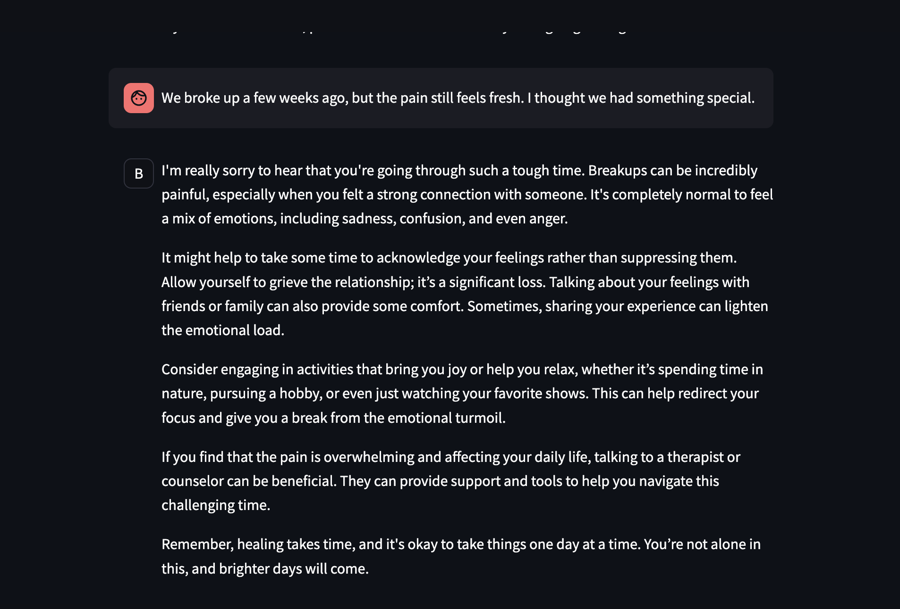
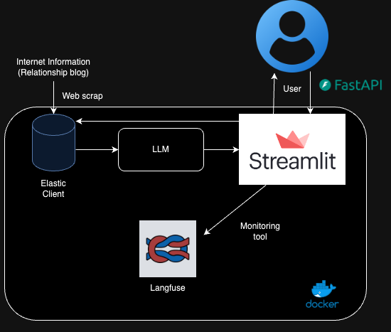
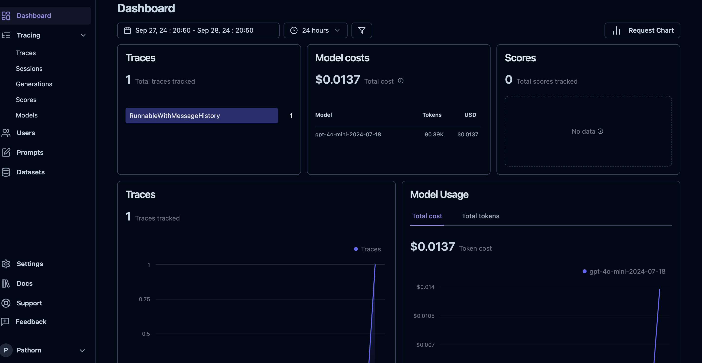

## Problem Description

Mental health services today face a significant challenge: while the need for therapy and mental health support continues to rise, the available resources and services struggle to meet this increasing demand. Many individuals experience long wait times before they can access proper care.

**Saddie**, the chatbot, aims to bridge this gap by providing an accessible, immediate, and empathetic conversational assistant. While it does not replace professional therapy, Saddie can offer support, guidance, and a listening ear to people as they wait for more formal mental health services. This chatbot serves as a helpful tool to alleviate stress, provide companionship, and give users a space to express their emotions in a safe and supportive environment.






## Setting Up a Poetry Project After `git clone`

Once you’ve cloned a Python project that uses **Poetry** for dependency management, follow these steps to set it up and start working.

### 1. Clone the Project

If you haven't already cloned the repository, you can do it using:

```bash
git clone https://github.com/PathornKiti/llm_zoomcamp_2024_project.git
cd llm_zoomcamp_2024_project
```

### 2. Dependencies install
After navigating into the project directory, install the project's dependencies. Poetry will read the pyproject.toml file and install everything specified there.

```bash
pipx install poetry
poetry install
poetry shell
```
[Poetry documentation](https://python-poetry.org/docs/)


### 3. Notebook Experiment
You can access the following Jupyter notebooks for different retrievers and evaluation tasks:

- [Elastic Retriever Notebook](notebook/mentalhealth_elastic.ipynb)
- [VectorDB Retriever (Chroma) Notebook](notebook/mentalhealth_chroma.ipynb)
- [Evaluation Data Generator Notebook](notebook/generate_evaluation.ipynb)
- [Evaluation Notebook](notebook/evaluation.ipynb)


### 4. Fill in the `.env` File

Create a `.env` file in the root directory of your project and fill it with the following values:

# OpenAI API Key
OPENAI_API_KEY="your_openai_api_key"

# Langfuse Configuration
LANGFUSE_PUBLIC_KEY="your_langfuse_public_key"


### 5. Docker Installation
you can build the Docker images with

```bash
docker-compose build
docker-compose up
```


### 6. Accessing the service
Once your Docker containers are up and running, you can access the following services:

- **Langfuse**: Accessible at [http://localhost:3000](http://localhost:3000). This is where you can interact with the Langfuse service.
  
- **Streamlit**: Accessible at [http://localhost:8501](http://localhost:8501). This is where you can view and interact with the Streamlit app.

#### Important Note:

When starting the program, there are a few processes that need to complete before everything is fully operational:

1. **Automated Ingestion and Data Checking**: After launching the program, the system will automatically start ingesting data into the Elasticsearch database and perform a data validation check. You need to wait for this process to finish before accessing the services.

2. **Uvicorn Server Start**: Once the data ingestion and checking process is complete, the Uvicorn server (which powers the backend) will start. Please wait until this server is fully running before accessing the services.



[Langfuse Document](https://langfuse.com/docs)


## Project Summary

# Project Summary

The increasing demand for mental health services has outpaced the available resources, leaving many individuals with long wait times before they can receive proper care. To bridge this gap, **Saddie**, an AI-powered chatbot, has been developed to provide immediate, accessible support to individuals in need of mental health assistance.

**Saddie** offers a conversational, empathetic interface that helps users manage stress, express emotions, and receive guidance while they await professional mental health services. It acts as a complementary tool to therapy, not a replacement, helping alleviate the burden on mental health services.

## Technologies Used

- **Langfuse**: A monitoring tool used for real-time tracking of chatbot performance, user interactions, and system health. Langfuse ensures that Saddie runs efficiently and reliably.
- **Streamlit**: A dashboard for visualizing chatbot usage data and performance metrics, allowing for easy evaluation and monitoring of Saddie's effectiveness.
- **PostgreSQL**: A relational database for managing user interactions, logs, and chatbot performance data.
- **Elasticsearch**: Used for efficient data ingestion and search functionality, enabling fast retrieval and analysis of large datasets.
- **Uvicorn**: A lightning-fast ASGI server that powers the backend, handling API requests and ensuring smooth interaction between the chatbot and users.
- **LLM**: Powers the chatbot's conversational capabilities, enabling Saddie to offer meaningful and empathetic responses in real-time.

By leveraging these technologies, Saddie provides a scalable, accessible, and real-time solution to help individuals manage their mental health while waiting for professional services, making it an innovative tool in mental health care.


